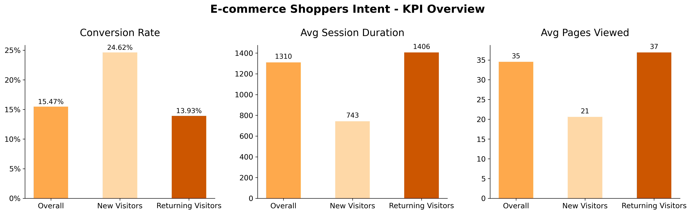
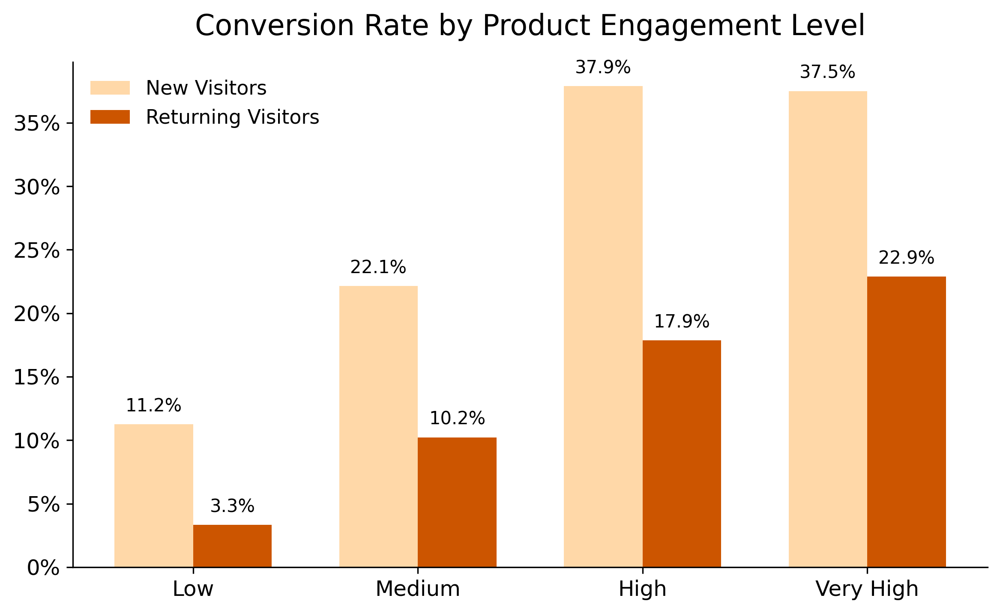
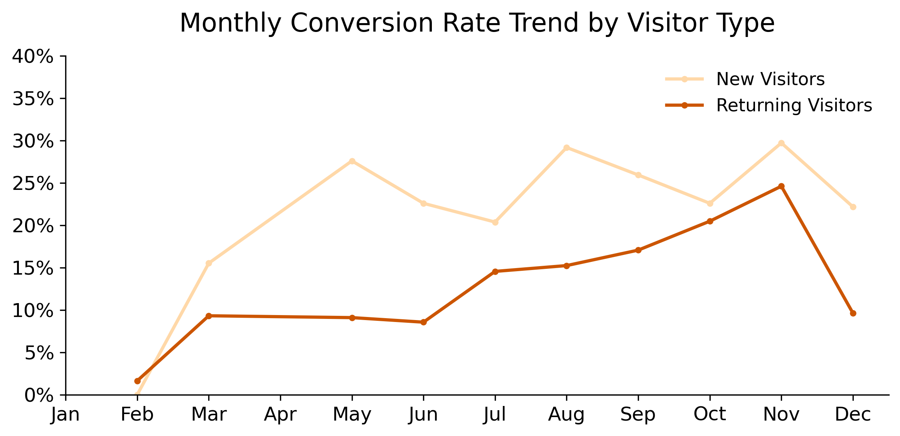

# ecommerce-kpi-dashboard
The goal of this project is to analyze the relationship between customer behavior and conversion to support business decision-making.

## Dataset
The dataset is highly imbalanced, with around 15.5% of sessions resulting in a purchase, while 84.5% did not.
In terms of visitor segmentation:
- New visitors: 1,694 sessions (422 purchases, 1,272 non-purchases)
- Returning visitors: 10,551 sessions (1,470 purchases, 9,081 non-purchases)

This imbalance reflects real-world e-commerce behavior, where the majority of sessions do not lead to a transaction.

## Key Insights
1. New visitors show higher conversion rates
2. Product engagement strongly influences conversion
3. Conversion trends vary across months

## Visualizations

### KPI Overview

### Product Engagement

### Monthly Trend

## Tools
- Python (pandas, matplotlib)
- Jupyter Notebook
