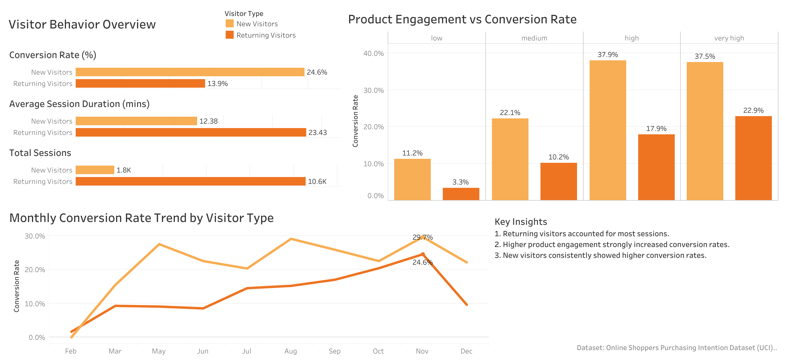

# E-commerce visitor behavior analysis
The goal of this project is to analyze the relationship between customer behavior and conversion to support business decision-making.

The project focuses on:
1. comparing new and returning visitors
2. analyzing engagement behavior
3. visualizing KPIs through an interactive dashboard

## Workflow
1. Data Processing & KPI Analysis (Python):
   
   data preprocessing
   
   feature engineering
   
   KPI calculation (Total Sessions, Conversion Rate, Average Session Duration, Product Engagement Level)
   
   exploratory analysis

3. Dashboard Visualization (Tableau Public):
   
   Visitor behavior comparison
   
   engagement vs conversion analysis
   
   monthly conversion trends
   
   KPI summaries

### Dashboard Preview

## Key Insights
1. New visitors show higher conversion rates
2. Product engagement strongly influences conversion
3. Conversion trends vary across months and may be influenced by seasonal factors

## Tableau Public Link
[View Interactive Dashboard on Tableau Public](https://public.tableau.com/views/E-commerceVisitorBehaviorDashboard/1?:language=en-US&:sid=&:redirect=auth&:display_count=n&:origin=viz_share_link)

## Dataset
The dataset is the Online Shoppers Purchasing Intention Dataset from the UCI Machine Learning Repository. It is highly imbalanced, with around 15.5% of sessions resulting in a purchase, while 84.5% did not.
In terms of visitor segmentation:
- New visitors: 1,694 sessions (422 purchases, 1,272 non-purchases)
- Returning visitors: 10,551 sessions (1,470 purchases, 9,081 non-purchases)

This imbalance reflects real-world e-commerce behavior, where the majority of sessions do not lead to a transaction.

[View Data Resource](https://archive.ics.uci.edu/dataset/468/online+shoppers+purchasing+intention+dataset)

## Tools
- Python (pandas, matplotlib)
- Jupyter Notebook
